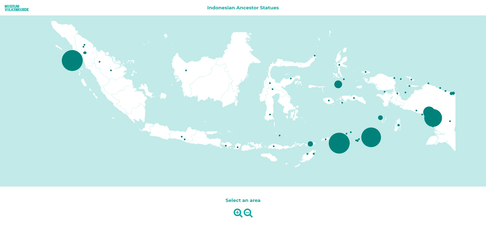
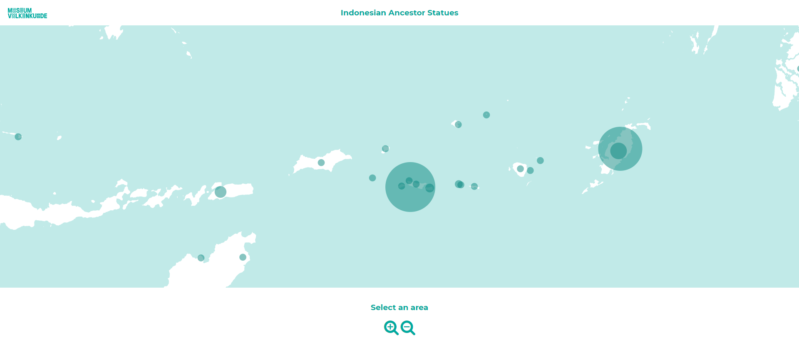
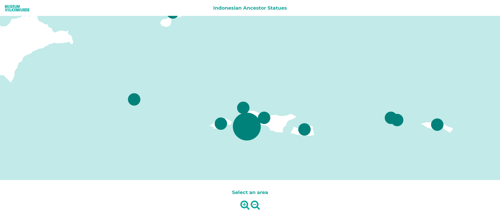

# Indonesian Ancestor Statues Map
this repo contains my assignment material for the course [functional programming](https://github.com/cmda-tt/course-19-20). The assignment entails visualizing data obtained from the Museum Volkenkunde's objects database using the [D3 Library](https://github.com/d3/d3).

**This current version shows all Indonesian ancestor statues on a map.**

I've tried to build it in a way this code can be used to show any kind of objects on any kind of map, keeping in mind the [key concepts of functional programming](https://github.com/lennartdeknikker/functional-programming/wiki/About-functional-programming-in-JavaScript)

## Concept and screenshots
The concept is to show certain objects, in this case Indonesian ancestor statues on a map. The user must be able to see where these objects come from and how many were brought from each location.

*Starting scale*


As you can see in these screenshots, the amount is shown by the size of te circles and the locations are plotted on the map.
Because some circles are plotted on top of each other, I added some opacity when zooming.

*Zoomed halfway*


As you zoom in some more, the circles will shrink and lose their opacity so it's easier to see at what exact locations the statues are found.

*Maximal zoom*


Check out my [wiki](https://github.com/lennartdeknikker/functional-programming/wiki/Concept) for more information on the concept.

## Usage
1. clone this repo using `git clone https://github.com/lennartdeknikker/functional-programming.git`
2. Open `index.html` to view the application

## Settings
Right now, there's a few settings to make it easier to work with different data, but I plan to have the code automatically adapt to different datasets or maps.

```
const settings = {
  scaleExtent: [.5, 20],
  minValueInData: 3,
  maxValueInData: 200
}
```

## References
This application uses:
- [the D3 Library](https://github.com/d3/d3)
- [JavaScript](https://developer.mozilla.org/en-US/docs/Web/javascript)
- [css](https://developer.mozilla.org/en-US/docs/Web/CSS)


## Used Data
The data used in this application is provided by the [Museum Volkenkunde](https://www.volkenkunde.nl/). They recently published their collection data. The data is obtained using [SPARQL](https://en.wikipedia.org/wiki/SPARQL) queries. The query used in this example is part of the code and can easily be changed to obtain different data to plot on the map. More information on the used data and queries can be found in the [wiki](https://github.com/lennartdeknikker/functional-programming/wiki/Data-and-SPARQL-queries)

## Functional Patterns
The assignment also entailed writing a functional pattern in JavaScript to clean up the data. The data I needed was clean by itself, so I wrote a pattern cleaning up the object extent data, which can be found [here](https://github.com/lennartdeknikker/extent-preprocessor)).

## plagiarism and Acknowledgements
I started off with [Ivan Ha](https://github.com/ivan-ha)'s [d3-hk-map](https://github.com/ivan-ha/d3-hk-map/blob/development/hongkong.js) to get acquainted with mapping data using the [D3 library](https://github.com/d3/d3). This has been very helpful to get the zoom functionality working and making it possible to select different areas on the map as well.

This current version uses [Rifani Frestiyanto](https://github.com/rifani)'s [geoJson files](https://github.com/rifani/geojson-political-indonesia).